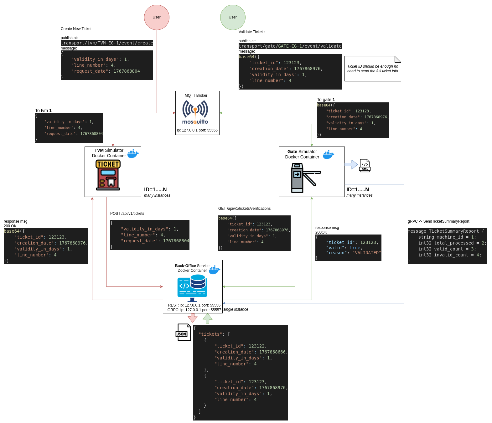

# transport-ticketing-sim-cpp
C++ server-client transport ticketing simulator


## System Bird's-Eye View


## Getting Started

### Developement Environment Preperation
#### Using VScode .devcontainer
This repository includes a VS Code Dev Container for a fully reproducible development environment with all required tools preinstalled.


Required Tools
- [Docker](https://docs.docker.com/engine/install/)
- [VS Code](https://code.visualstudio.com/Download)
- [VS Code Remote – Containers extension](https://marketplace.visualstudio.com/items?itemName=ms-vscode-remote.remote-containers)


Inside Vscode Press `F1` then write ` >dev containers: Rebuild and reopen in Container` 

#
Having that the development environment is established successfully you can proceed with the following sections

#### Build the applications
```bash
# at repo top dir
$ mkdir build
$ cd build
$ cmake ..
$ make
```
Result
```
build/
 |/back-office/
 |/gate/
 |/ticket-vending-machine/
 |/proto
```

after build the proto dir in the repo top dir will contain generated protobuf grpc c++ code to be compiled into a shared lib and to be used by the `back-office` service and `gate` client

### Use docker compose to fire up all the apps
docker compose up will start
- MQTT Broker : TCP Port `29999` 
- Back-Office HTTP Server : TCP Port `55556` 
- Back-Office gRPC Server : TCP Port `55559` 
- client gate application
- client ticket-vending-machine application

### User can use postman to test HTTP and gRPC server (back-office)
Examples can be found in the [back-office](back-office)

### Apps logs and Analytics
the .devcontainer has bind to the repo dir `.runtime-files`
apps will create it's Persistent files into it

example:
```bash
GATE-EG-3.xml
# <GateReport>
#     <GateId>GATE-EG-3</GateId>
#     <Summary>
#         <TotalValidations>3</TotalValidations>
#         <ValidCount>3</ValidCount>
#         <InvalidCount>0</InvalidCount>
#         <OnlineCount>0</OnlineCount>
#         <OfflineCount>3</OfflineCount>
#     </Summary>
#     <Validations>
#         <Validation>
#             <TicketBase64>eyJjcmVhdGlvbl9kYXRlIjoxNzY3OTgzNDg5LCJsaW5lX251bWJlciI6MSwidGlja2V0X2lkIjowLCJ2YWxpZGl0eV9pbl9kYXlzIjoxfQ==</TicketBase64>
#             <Strategy>OFFLINE</Strategy>
#             <Result>VALID</Result>
#             <Timestamp>1768066912</Timestamp>
#         </Validation>...
tickets.json
# {
#     "tickets": [
#         {
#             "creation_date": 1768005495,
#             "line_number": 1,
#             "ticket_id": 1,
#             "validity_in_days": 1
#         },
#         {
#             "creation_date": 1768005502,
#             "line_number": 1,
#             "ticket_id": 2,
#             "validity_in_days": 1
#         },
#         {
#             "creation_date": 1768005509,
#             "line_number": 1,
#             "ticket_id": 3,
#             "validity_in_days": 1
#         }, ...
```
### start the system
User can start the MQTT broker from his host machine by running at the repo top dir
```bash
# at repo top dir
$ docker compose up

# to stop run `docker compose down`
```
#### for the apps user can start them inside the .devcontainer
after building
```bash
$ ./build/back-office/back-office_app
$ GATE_ID=GATE-1 ./build/gate/gate_app
$ ./build/ticket-vending-machine/ticket-vending-machine_app
```

#### run each seperate
```bash
# at repo root dir
docker build -t ticket-vending-machine:v0 -f ./ticket-vending-machine/dockerfile .
docker run --name ticket-vending-machine-con --network host -v ./transport-ticketing-sim-cpp/.runtime-files:/data/ ticket-vending-machine:v0 

docker build -t gate:v0 -f ./gate/dockerfile .
docker run -e GATE_ID="GATE-EG-88" --name gate-con --network host -v ./.runtime-files:/data/ gate:v0 

```

### Test cases
sample test can be found in `end-to-end-test-script.sh`


**Note** ℹ 
We are assuming that the **ticket request date = creation date in the back-office** and it's reflected in the code this way
```mqtt
PUB /transport/tvm/1/event/create
{
  "validity_in_days": 999,
  "line_number":2,
  "request_date":1768071041
}
```

sample test
```mqtt
PUB /transport/gate/GATE-1/event/validate
PAYLOAD='eyJjcmVhdGlvbl9kYXRlIjoxNzY4MDcxMDQxLCJsaW5lX251bWJlciI6MiwidGlja2V0X2lkIjoxLCJ2YWxpZGl0eV9pbl9kYXlzIjo5OTl9'
```
### Testing scripts
in the file `start-new-gate.sh`
You will see that user is able to start gates at runtime as every gate has its own id ex:`GATE_ID="GATE-EG-3" $APP_GATE &`
example
```bash
$ ./start-new-gate.sh GATE-EG-7
    The value of gate_id is: GATE-EG-7
    [GATE] Started with GateID= GATE-EG-7
    connecting to the MQTT broker 
    Connecting...
    connected...
    Connected MQTT broker 
    subscribing to topic: /transport/gate/GATE-EG-7/event/validate
    subscribed to topic: /transport/gate/GATE-EG-7/event/validate
    Re-connected! Re-subscribing to ensure topics are active...
    retrying to handle in the Q .
```

#### Run Unit tests
```bash
## at the build dir 

# for app back-office
$ GTEST_COLOR=1 ctest --test-dir ./back-office/tests/  -V
```
#### Generate Coverage Report
```bash
$ cmake -DBUILD_TESTING=1 -DENABLE_COVERAGE=1 ..
$ GTEST_COLOR=1 ctest --test-dir ./back-office/tests/  -V
$ make -j
$ lcov --directory . --zerocounters
$ lcov --directory . --capture --output-file coverage.info
$ lcov --remove coverage.info '/usr/*' '*generated*' '*tests*' --output-file coverage.info
$ genhtml coverage.info --output-directory coverage_report
```
## Video showing system interop

[testing-ticketing-sys-sim.webm](https://github.com/user-attachments/assets/54b9bdf2-7e66-4442-b11a-44355265d2e0)

