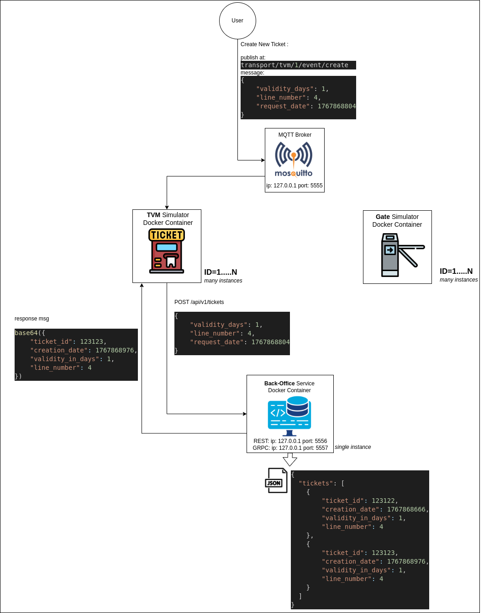

# ticket-vending-machine (TVM)

Simulated ticket vending machine container responsible for
- Receive ticket info via MQTT 
- Send ticket creation request to the Back-Office as REST Api request
- Receive from Back-Office the created ticket as base64 data.

## Ticket Creation bird view



## TVM internally

### responses from backend
```json
{
    "ticket_id": 123123,
    "valid": true,
    "reason": "VALIDATED"
}

{
    "ticket_id": 123123,
    "valid": false,
    "reason": "EXPIRED"
}

{
    "ticket_id": 123123,
    "valid": false,
    "reason": "LINE_MISMATCH"
}


{
    "ticket_id": 123123,
    "valid": false,
    "reason": "NOT_FOUND"
}
```